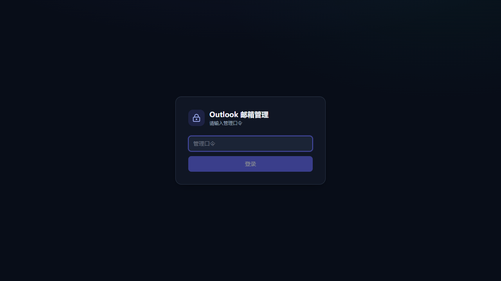
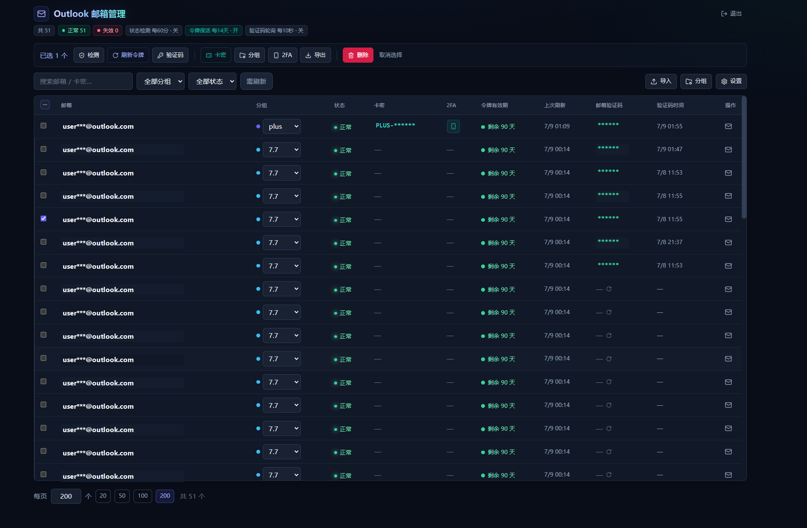

# Outlook 邮箱管理系统

架构边界和关键安全不变量见 [docs/ARCHITECTURE.md](docs/ARCHITECTURE.md)。

批量管理 Outlook / MSA 账号，在线读取收件箱、自动提取验证码、检测账号状态，并低频刷新令牌防止失效。

账号格式（每行一个）：

```
邮箱----密码----ClientId----RefreshToken
```

## 技术栈

Next.js 15 (App Router) · Prisma + SQLite · Tailwind CSS。
密码与令牌全部使用 AES-256-GCM 加密入库。读信优先走 Outlook REST API，Graph 仅作兜底；不再使用 IMAP。

## 推荐部署：Docker 空库一键安装

公开仓库默认按**空数据库**部署，不迁移任何本机账号数据。部署脚本会自动生成 `APP_SECRET`、创建 `.env` / `docker-compose.yml`、启动容器并检查 `/login` 和 `/redeem`。

```bash
cd /opt
git clone https://github.com/k-kedrick/outlook-mail-manager.git
cd outlook-mail-manager
sh deploy/scripts/install.sh
```

脚本支持三种访问方式：

- `reverse-proxy`：推荐，绑定 `127.0.0.1:3005`，配合 Nginx/Caddy/宝塔和 HTTPS。
- `direct-ip`：绑定 `0.0.0.0:3005`，可用 `http://服务器IP:3005` 访问。
- `local`：绑定 `127.0.0.1:3005`，只用于本机测试。

详细部署、更新、备份和删除重装见 [DEPLOY.md](DEPLOY.md)。安全注意事项见 [SECURITY.md](SECURITY.md)。

## 本地开发

```bash
npm install
cp .env.example .env        # 然后修改 APP_SECRET / ADMIN_PASSWORD
npx prisma migrate dev      # 初始化数据库（首次）
npm run dev                 # 启动，访问 http://localhost:3005
```

默认登录口令由 `.env` 的 `ADMIN_PASSWORD` 决定，请务必修改为自己的强密码。

## 环境变量

| 变量 | 说明 |
| --- | --- |
| `DATABASE_URL` | SQLite 路径，默认 `file:./dev.db` |
| `APP_SECRET` | 加密密钥。**修改后已存储的密文将无法解密** |
| `ADMIN_PASSWORD` | 管理后台登录口令；如果已在设置中改过密码，则优先使用数据库里的哈希 |

生产环境会拒绝缺失、少于 32 字符或使用公开默认值的 `APP_SECRET`，也会拒绝 `ADMIN_PASSWORD=change-me`。修改后台密码后，所有浏览器的旧登录状态会立即失效。

## 健康检查与安全接口

- `GET /api/health` 同时检查应用与 SQLite，适用于 Docker/Nginx 监控。
- 登录、公开卡密、验证码和 TOTP 接口包含应用侧限流；公网仍建议叠加 Cloudflare 限流。
- API 响应默认禁止缓存，公开接口不会返回 Outlook、Graph 或数据库原始错误。

## 功能

- **批量导入**：粘贴 `----` 分隔的多行账号，自动去重、按邮箱 upsert，逐行报告无效项。
- **分组 / 搜索 / 筛选**：按分组、状态、邮箱关键字筛选，行内可直接改分组。
- **检测状态**：单个或批量只读探测账号状态，不主动轮换 RefreshToken。
- **读取收件箱**：查看邮件列表与单封正文（HTML 沙箱 iframe 渲染 / 纯文本）。
- **自动提取验证码**：扫描最新邮件识别验证码，一键复制。
- **凭据脱敏**：列表接口永不下发明文；仅在点击「显示 / 复制」时经 `reveal` 接口解密。
- **导出**：所选账号可按字段导出为 `----` 格式文本；RefreshToken / 2FA 密钥属于敏感字段。
- **刷新令牌与风险预警**：记录每个账号的“上次刷新令牌时间”，按剩余有效期给出风险徽章；刷新令牌是低频保活动作，和检测状态分离。

## 项目截图

### 登录页



### 后台管理页

> 公开截图已对邮箱、卡密和邮箱验证码做脱敏处理。



### 卡密兑换页


## 刷新令牌与保活（重要）

- **访问令牌**约 1 小时；**刷新令牌**是**滑动过期**：每次使用微软都会换发新令牌并顺延有效期，只要在**闲置上限（约 90 天不使用即失效）**前用过就能一直续。长期不刷新才会失效。
- **拿不到精确到期时间**：令牌端点通常不返回刷新令牌到期；本系统以“上次刷新令牌时间”推算风险。少数账号返回 `refresh_token_expires_in` 时会显示令牌到期时间。
- 因此系统提供**低频自动刷新令牌（保活）**，只处理到期/临期账号：

**A. 应用内定时器（应用运行时自动）**
由 `src/instrumentation.ts` 在服务器启动时拉起，间隔可在后台「设置」中调整。**仅在应用/服务运行时有效**——建议让应用常驻（`npm run build && npm start`，或用任务计划在登录时自动启动）。

**B. 独立脚本 + Windows 任务计划（不开应用也能续期，推荐叠加）**
```bash
npm run keep-alive          # 手动跑一次；直连数据库，无需启动网站
```
如需脱离网站保活，可用任务计划低频自动跑（管理员 PowerShell / CMD 执行一次即可注册）：
```bat
schtasks /Create /TN "OutlookKeepAlive" /TR "D:\project\outlook\scripts\keep-alive.bat" /SC DAILY /MO 7 /ST 03:00 /F
```
脚本日志写入 `scripts/keep-alive.log`。删除任务：`schtasks /Delete /TN "OutlookKeepAlive" /F`。

> 说明：`invalid_grant`（红色「令牌失效」）与「需续期」是两回事——前者已作废需重新导入，后者只是临期、续一下即可。

## 「检测状态」与「刷新令牌」是两件事（防封号，重要）

MSA 刷新令牌**单次使用、每次刷新即轮换**；短时间内过多轮换会触发微软风控 → 锁定/封号。因此本系统把两者严格分开：

| | 检测状态 | 刷新令牌（保活） |
| --- | --- | --- |
| 目的 | 及时发现失效/被封 | 防止 ~90 天闲置失效 |
| 是否轮换令牌 | **否**（只读探测，复用缓存访问令牌） | **是**（强制刷新→轮换） |
| 安全频率 | 可较频繁（默认每 **360 分钟 = 6 小时**，最低 5 分钟） | 低频（默认每 **7 天**，仅刷到期账号） |
| 手动按钮 | 「检测状态 / 检测所选状态」 | 「刷新令牌 / 刷新所选」 |
| 定时开关 | 设置 → 自动检测状态 | 设置 → 自动刷新（保活） |

- **状态检测**用缓存的访问令牌（~55 分钟有效）发一个只读请求探活，**零轮换**；仅当缓存过期才刷新一次，因此**无论检测多频繁，单账号轮换上限 ≈ 每小时 1 次**（等同一个正常活跃客户端），安全。
- **轮换护栏**：任何路径对同一账号**5 分钟内不会重复打令牌端点**（`MIN_ROTATION_INTERVAL_MS`），防连点/并发风暴；批量操作带抖动，避免同 IP 同时大量认证。
- **保活**（会轮换）保持每 N 天、仅刷到期账号；间隔不要设太短。
- 读信 / 验证码轮询同样复用缓存、不额外轮换，成功/失败也会顺带更新状态。

## OAuth / 读信说明

- 令牌端点：`https://login.microsoftonline.com/consumers/oauth2/v2.0/token`（公有客户端，无 secret），
  失败时回退 `https://login.live.com/oauth20_token.srf`。每次刷新都会**轮换刷新令牌**，系统自动回写加密的新令牌。
- **读信走 HTTPS，不用 IMAP**：这些账号的 client（如 `9e5f94bc-…`）只授权 `outlook.office.com`
  资源（其令牌含 `Mail.ReadWrite` 等），并**未授权 Graph**，且 Outlook 对这些账号**拒绝 IMAP XOAUTH2 登录**。
  因此读信使用 **Outlook REST API**（`https://outlook.office.com/api/v2.0/me/MailFolders/{Inbox|JunkEmail}/messages`），
  纯 HTTPS，可穿过代理/VPN。scope：`https://outlook.office.com/IMAP.AccessAsUser.All offline_access`
  （实际会授予含 Mail.ReadWrite 的整组权限）。
- 若某账号改用 Graph，系统会自动回退到 `https://graph.microsoft.com/v1.0`（scope `Mail.Read`）。
  每个账号首次成功后会**记住可用协议**（`mailProtocol` = outlook / graph），后续直接用它。
- 令牌均为 `outlook.office.com` 资源令牌，无法用于 Graph；两者 scope/audience 不同，代码里分别换取。

> 注：`imapflow` / `mailparser` 依赖已不再使用（保留在 `package.json` 中不影响运行，可择机移除）。

## 卡密兑换页 `/redeem`

- `/redeem` 是公开兑换页，不需要管理员登录；卡密只用于找到绑定账号。
- `/api/redeem/code` 只走邮箱验证码读取路径，不调用 `checkAccount`、keep-alive 或 `forceRefresh`。
- `/api/redeem/totp` 只做本地 TOTP 计算，不读取邮箱、不刷新令牌、不返回 2FA 密钥明文。
- 公开接口只返回邮箱、邮箱验证码、验证码时间和 TOTP 动态码，不返回密码、ClientId、RefreshToken、卡密明文或 2FA 密钥明文。

## 部署方式概览

完整功能需要 Node.js 服务端环境。推荐把 GitHub 作为源码仓库，将项目部署到 VPS、Windows/Linux 服务器或 Docker 容器中运行。

- 推荐：Docker Compose 空库一键部署，SQLite 挂载到 `data/` 持久目录。
- 可选：VPS / Windows / Linux Node 服务，SQLite 数据库保存在服务器本地持久目录。
- 不推荐：GitHub Pages。它只能托管静态文件，不能运行 API、Prisma、SQLite 或后台定时器。
- 不推荐：当前架构直接上 Vercel。SQLite 不适合 serverless 文件系统持久写入。

详细步骤见 [DEPLOY.md](DEPLOY.md)。

Docker 首次构建时 `Building xx/xx` 和 `exporting layers` 是正常进度；只有 `ERROR`、`failed`、`CANCELED`、`Restarting` 才需要按部署文档排查。

## 公开发布注意事项

本项目会处理账号密码、RefreshToken、2FA 密钥、卡密和邮箱验证码。公开仓库发布前必须确认没有提交真实数据。

- 不要提交 `.env`、`prisma/dev.db`、数据库备份、日志或真实导出文件。
- 不要提交未脱敏截图。
- 公开截图应只使用 `docs/images/` 下的脱敏图片。

安全清单见 [SECURITY.md](SECURITY.md)。
